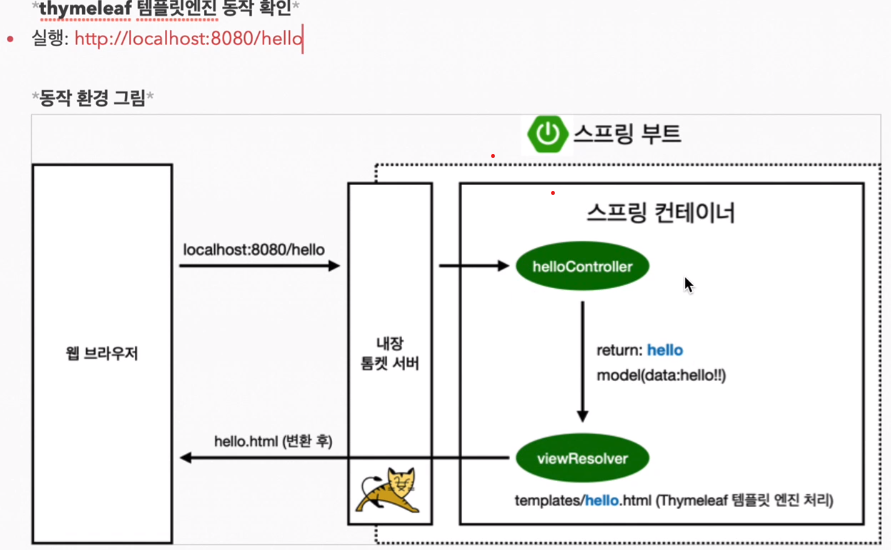

# 1강 View 설정

1. 화면 설정 방법
  1) static 설정 방법
    - resource/static/index.html에 hello world Html 삽입
    - 단순히 welcome page에 html을 보여주는 방식

  2) thymeleaf을 이용한 동적 화면 설정 방법
    - resoruce/template/hello.html 에 hello 코드
    ``` html
    <!DOCTYPE HTML>
    <html xmlns:th="http://www.thymeleaf.org">
    <head>
        <title>Getting Started: Serving Web Content</title>
        <meta http-equiv="Content-Type" content="text/html; charset=UTF-8" />
    </head>
    <body>
    <p th:text="'안녕, ' + ${data} + '!'" >안녕하세요. 손님</p>
    </body>
    </html>
    ```
    - java/hello/helloSpring/controller/helloController.java 생성
    ``` java
    package hello.hellospring.controller;

    import org.springframework.stereotype.Controller;
    import org.springframework.ui.Model;
    import org.springframework.web.bind.annotation.GetMapping;

    @Controller
    public class helloController {

        @GetMapping("hello")
        public String hello(Model model){
            model.addAttribute("data", "hello!!!");
            return "Hello";
        }
    }
    ```
    - spring/thymeleaf/tomcat 처리 과정
    
    - tomcat이 우선 client 요청 입력 받음 -> spring에게 전달
    - @GetMapping 태그를 통해 /hello URL이 들어온 경우 spring에서 helloController.hello 메소드 수행
      - model 파라미터는 기본적으로 제공되는듯? 추후 찾아 볼 것
      - return string 값을 통해 ViewResolver가 template 내 hello.html을 반환
        - 클래스로더와 연관되어서 resoruce:template/ + {ViewName} + .html 방식으로 호출

  - 강의 선생님이 말씀하신 팁
    - spring.io에 doc를 통해서 찾는 연습/능력이 있어야 실력이다

  - 기억해야할 개념
    - MVC 개념
