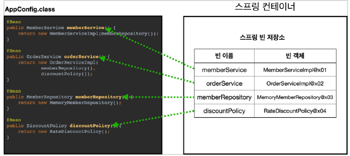

## 강의내용

1. 스프링 컨테이너 생성
  - 저번시간에 컨테이너 생성 및 적용 방법
  ``` java
  //스프링 컨테이너 생성
  ApplicationContext applicationContext =
  new AnnotationConfigApplicationContext(AppConfig.class);
  ```
  - ApplicationContext는 인터페이스
  - 스프링 컨테이너는 XML을 기반으로 만들 수 있고, 애노테이션 기반의 자바 설정 클래스로 만들 수 있다.
    - 거의 XML로는 사용하지 않음
    - 이전 시간에 AppConfig클래스를 만든게 애노테이션 기반으로 만든 것
  - ※ 더 정확히는 스프링 컨테이너를 부를 때 BeanFactory , ApplicationContext 로 구분해서 이야기
한다. 이 부분은 뒤에서 설명하겠다. BeanFactory 를 직접 사용하는 경우는 거의 없으므로 일반적으로
ApplicationContext 를 스프링 컨테이너라 한다.


2. 스프링 빈 등록
  - 스프링 컨테이너는 파라미터로 넘어온 설정 클래스 정보를 사용해서 스피링 빈을 등록한다.
    
    - 빈 이름은 메서드 이름을 사용하거나 직접 부여할 수도 있다.
      - @Bean(name="memberService2")
    - 빈 이름은 항상 다른 이름을 부여해야 한다. 같은 이름을 부여하면, 다른 빈이 무시되거나, 기존 빈을 덮어버리는 오류가 발생한다.

3. 스프링 빈 의존관계 설정
  - 스프링 컨테이너는 설정 정보를 참고해서 의존 관계를 주입(DI)한다.
  - 단순히 자바 코드를 호출하는 것 같지만, 차이가 있음(싱글톤 컨테이너에서 설명)
  


4. BeanFactory와 ApplicationContext
  
  - BeanFactory
    - 스프링 컨테이너의 최상위 인터페이스
    - 스프링 빈을 관리하고 조회하는 역할을 담당
    - getBean()을 제공
    - 우리가 사용했던 대부분의 기능은 BeanFactory가 제공하는 기능
  - ApplicationContext
    - BeanFactory 기능을 모두 상속받아서 제공
    - 애플리케이션을 개발할 때 빈을 관리하고 조회하는 기능, 수 많은 부가 기능이 필요
      - **메시지소스를 활용한 국제화 기능**
        - 예를 들어서 한국에서 들어오면 한국어로, 영어권에서 들어오면 영어로 출력
      - **환경변수**
        - 로컬, 개발, 운영 등을 구분해서 처리
      - **애플리케이션 이벤트**
        - 이벤트를 발행하고 구독하는 모델을 편리하게 지원
      - **편리한 리소스 조회**
        - 파일, 클래스 패스, 외부 등에서 리소스를 편리하게 조회
        

    : **정리**
    - ApplicationContext는 BeanFactory의 기능을 상속
    - ApplicationContext는 빈 관리기능 + 편리한 부가 기능을 제공
    - BeanFactory를 직접 사용할 일은 거의 없다. 부가 기능이 포함된 ApplicationContext를 사용
    - BeanFactory/ApplicationContext를 스프링 컨테이너라 한다.

  5. 다양한 설정 형식 지원 - 자바 코드, XML, 등등
    - 스프링 컨테이너는 다양한 형식의 설정 정보를 받아드릴 수 있게 유연하게 설계
      - 자바코드, XML, Groovy, Custom하게 설정 가능
      
        - AnnotationConfigApplicationContext
          - 기존에 사용했던 애너테이션 자바 코드로 설정
        - GenericXmlApplicationContext
          - XML 기반의 설정에 사용되는 클래스
          - XML를 사용하면 컴파일 없이 빈 설정정보를 변경할 수 있는 장점이 있다.

  6. 스프링 빈 설정 메타 정보 - BeanDefinition
    - 스프링은 어떻게 이런 다양한 설정 형식을 지원하는 것일까?
        - 'BeanDefinition' 이라는 추상화가 있다.
    - 쉽게 이야해서 역할과 구현을 개념적으로 나눈 것이다.
        - XML을 읽어서 BeanDefintion을 만들거나, 자바코드를 읽어서 BeanDefinition을 만든다
        - 스프링 컨테이너는 오직 BeanDefinition을 바라만 보면 된다.
    - 'BeanDefinition'을 빈 설정 메타정보라 한다.
        - '@Bean', '<Bean>'당 각각 하나씩 메타 정보가 생성된다.
    
    - 코드 레벨 설명
      
      - AnnotationConfigApplicationContext 클래스 내 AnnotatedBeanDefiniitionReader를 통해 BeanDefinition을 생성

    - BeanDefinition 알아보기
      - 내부에 여러 필드들이 존재, 추후 필요시 찾아볼 것

    - *정리*
      - BeanDefinition을 직접 생성해서 스프링 컨테이너 등록할 수 있다. 하지만 실무에서는 거의 직접하지 않음
      - BeanDefinition에 대해서 자세한 이해보다는 개념을 알고 넘어가자
